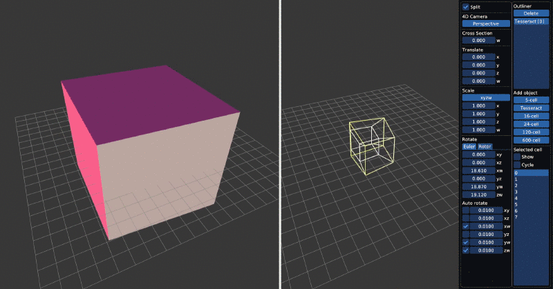

# Four

An application for real-time rendering of
[four-dimensional](https://en.wikipedia.org/wiki/Four-dimensional_space)
objects.



## Features

* Simultaneous
  [cross-section](https://en.wikipedia.org/wiki/Cross_section_(geometry)) and
  [projection](https://en.wikipedia.org/wiki/Graphical_projection) visualization
* Geometry generation of the 6
  [regular convex 4-polytopes](https://en.wikipedia.org/wiki/Convex_regular_4-polytope)
* Translation, scaling and rotation

## Download

[Download the latest release here](https://github.com/psandbrook/four/releases/tag/v0.1.0)

## Build

Prerequisites:

* CMake 3.16
* Recent GCC or Clang

Use CMake to build:

```bash
cd /path/to/repository
mkdir build
cd build

# To use Clang, use -DCMAKE_C_COMPILER=clang -DCMAKE_CXX_COMPILER=clang++
cmake .. -G 'Unix Makefiles' -DCMAKE_C_COMPILER=gcc -DCMAKE_CXX_COMPILER=g++ -DCMAKE_BUILD_TYPE=Release

make -j$(nproc)
```

## Command line interface

* `--generate <name>`: Generate the named regular convex 4-polytope and write it
    to a `.mesh4` file. Valid values for `<name>` are `5-cell`, `tesseract`,
    `16-cell`, `24-cell`, `120-cell`, and `600-cell`.

## GUI controls

* Rotate 3D camera: hold right mouse button & move mouse
* Pan 3D camera: hold shift + right mouse button & move mouse
* Zoom 3D camera: scroll wheel
